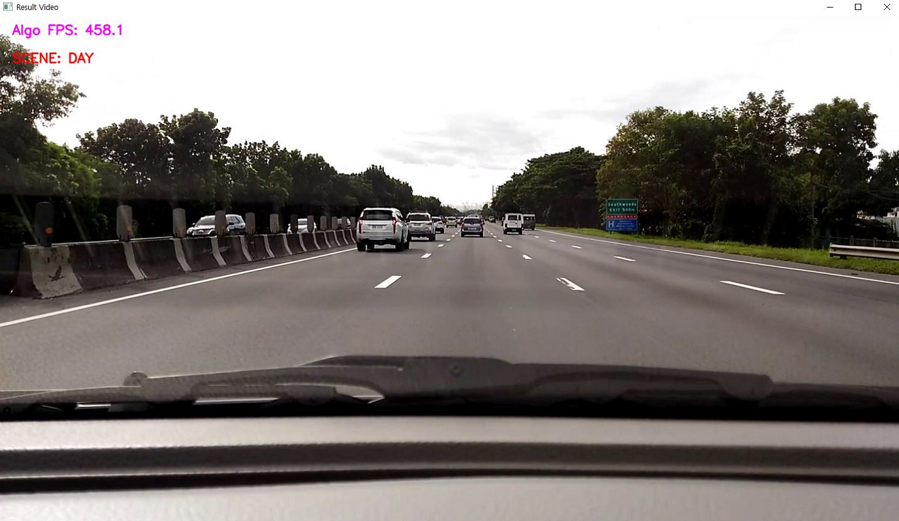
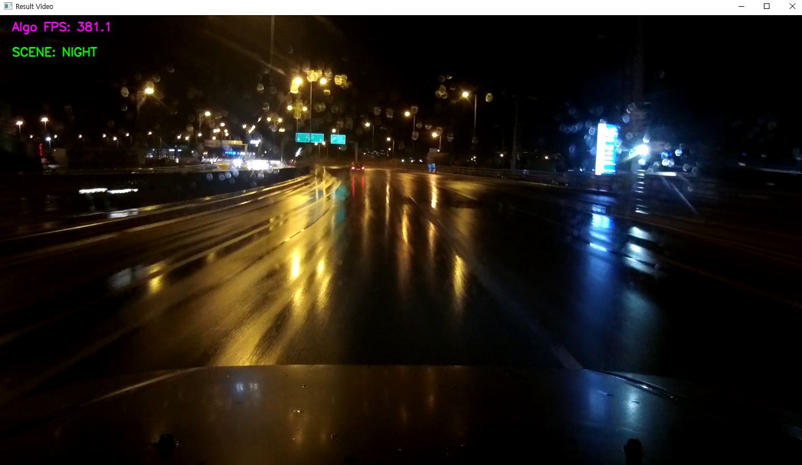

# 🌗 Real-Time Day/Night Scene Recognition

**High-Performance CPU-Only Driving Scene Classifier with Temporal Consistency**

> ⚡ **350+ FPS on Intel i7-10700 (Full-HD)** | Zero GPU Dependency | Pure NumPy/OpenCV Vectorization

## 📌 Overview

This repository provides a production-grade, real-time day/night scene classification engine optimized for CPU-only environments. The pipeline is implemented using NumPy vectorization and OpenCV primitives, achieving 350+ FPS on Full-HD (1920×1080) without any GPU acceleration.

The system analyzes sky region luminance distributions and edge characteristics to classify driving scenes as **Day**, **Night**, or **Unknown**, with built-in temporal stabilization to prevent state flipping in tunnels and under artificial lighting.

### 🎯 Key Highlights

| Feature | Specification |
| :--- | :--- |
| **Throughput** | 350+ FPS @ 1920×1080 (Intel i7-10700) |
| **GPU Requirement** | ❌ None (Pure CPU) |
| **Language** | Python 3.8+ |
| **Core Libraries** | NumPy, OpenCV, PyYAML, Pillow |
| **Temporal Stability** | Buffer Voting + Hysteresis + Duration Lock |
| **Configuration** | YAML-based (no code modification needed) |
| **Cross-Platform** | Windows / Ubuntu / macOS |

## 🔬 Methodology

### Algorithm Pipeline

```
Input Frame → ROI Extraction → Y-Channel Conversion → NN Resize
           → Step 1: Histogram Classification (Day/Night/Unknown)
           → Step 2: Sobel Edge + Dilation Secondary Night Check (conditional)
           → Temporal Stabilization (Vote Buffer + Hysteresis + Lock)
           → Final State Output
```

#### Step 1: Histogram-Based Primary Classification
Computes luminance histogram of the sky ROI to determine dark/bright pixel ratios. Clear day/night scenes are resolved immediately at this stage (~0.3ms).

#### Step 2: Edge-Morphology Secondary Night Classification
Executed **only when Step 1 is inconclusive**. Detects local high-intensity light sources (streetlights, headlights) via Sobel edges, removes them through 5×5 morphological dilation, and recalculates night score using only background sky pixels.

#### Temporal Stabilization Layer
Three mechanisms combined to ensure consistent output across challenging scenarios:

-   **Buffer Voting:** Majority vote over sliding window (default: 5 frames) absorbs instantaneous noise spikes
-   **Hysteresis Thresholds:** Exit thresholds set stricter than entry thresholds prevent state oscillation at decision boundaries
-   **Minimum Duration Lock:** State transitions blocked for configurable minimum duration (default: 2s) during tunnel passages

## ✨ Key Features

-   **Zero GPU dependency** — runs entirely on CPU with real-time performance
-   **YAML-driven configuration** — all thresholds, ROI ratios, and display settings adjustable without code changes
-   **Ratio-based adaptive ROI** — automatically scales to any input resolution (720p, 1080p, 4K)
-   **Per-file state reset** — complete algorithm reinitialization between video files
-   **Adaptive OSD rendering** — TTF font with non-linear scaling maintains readability at any display scale
-   **Pure algorithm FPS meter** — measures only classification time, excluding I/O and rendering overhead
-   **Debug visualization** — 6 intermediate-stage windows for parameter tuning and validation
-   **Bonnet-line alignment guide** — documented ROI tuning workflow for vehicle-specific calibration

## 📦 Installation

```bash
# Create virtual environment (recommended)
python -m venv .venv
source .venv/bin/activate        # Linux/macOS
# .venv\Scripts\activate         # Windows

# Install dependencies
pip install -r requirements.txt
```

### Core Requirements

-   Python ≥ 3.8
-   NumPy ≥ 1.24.0
-   OpenCV ≥ 4.8.0 (`opencv-python`)
-   PyYAML ≥ 6.0.1
-   Pillow ≥ 10.0.0 *(optional, for anti-aliased TTF OSD)*

## 🚀 Quick Start

### 1. Configure Input Source

Edit `config.yaml`:

```yaml
input_path: "./videos/sample.mp4"   # Single file or folder path
video_extension: ".mp4"             # Target extension for folder mode
display_scale: 0.75                 # Output window scale (adjust for your screen)
```

### 2. Run

```bash
# Default config
python main.py

# Custom config
python main.py -c my_config.yaml
```

### 3. Keyboard Controls

| Key | Action |
| :--- | :--- |
| `ESC` | Terminate program |
| `ENTER` | Skip current file, proceed to next |
| `SPACE` | Pause / Resume |

## 🖼️ Sample Results

### Daytime Classification


### Nighttime Classification


## ⚙️ Configuration Reference

All parameters are defined in `config.yaml`. Key sections:

| Section | Description |
| :--- | :--- |
| `Input Source` | Video file/folder path, target extension |
| `Display Settings` | Output scale factor (adaptive to any resolution) |
| `ROI Settings` | Ratio-based sky region with bonnet alignment guide |
| `Step 1 Thresholds` | Histogram intensity ranges and ratio thresholds |
| `Step 2 Thresholds` | Sobel magnitude, candidate night range |
| `Temporal Stability` | FPS, lock duration, vote window, hysteresis exits |
| `Debug Options` | Main display, debug windows, ROI overlay toggle |

See inline comments in `config.yaml` for detailed mathematical meaning and tuning guidance for every parameter.

## 📊 Benchmark

| Metric | Value | Test Environment |
| :--- | :--- | :--- |
| **Pure Algorithm FPS** | **350+** | Intel Core i7-10700 @ 2.90GHz, 1920×1080 |

> ⚡ FPS measured via `time.perf_counter()` wrapping only `analyzer.run()`. Excludes video decoding, frame resizing, OSD rendering, and display sync.

## 🗂 Project Structure

```text
day_night_recognition/
├── config.yaml          # All algorithm parameters and thresholds
├── utils.py             # Config loading, TTF renderer, debug viz, statistics
├── scene_analyzer.py    # Core classification engine (vectorized)
├── main.py              # Entry point with argparse CLI
├── requirements.txt     # Pinned dependencies
├── assets/              # Sample result screenshots
│   ├── day_result.png
│   └── night_result.png
└── README.md
```

## 🧭 ROI Tuning Guide

The bottom edge of the ROI **must align with the vehicle bonnet (hood) line**. This is the single most critical tuning parameter.

1.  Set `draw_roi_on_main: true` and `show_process: true`
2.  Run on representative footage
3.  Adjust `roi_height_ratio` in 0.005 increments until the green rectangle's bottom edge sits exactly on the bonnet top
4.  Validate against 3–5 clips covering day, night, and tunnel scenarios

See the `★ BONNET LINE ALIGNMENT GUIDE` section in `config.yaml` for full details.

## 📄 License

This project is licensed under the MIT License.
